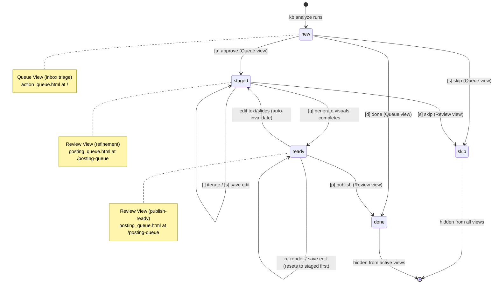
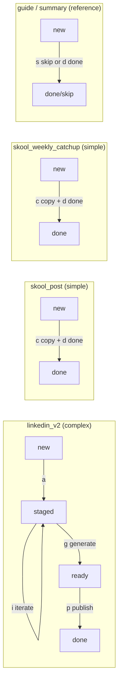

# T028: Content Lifecycle UX Exploration

## 1. State Machine Diagram

### 1.1 Master State Diagram (Mermaid)



### 1.2 State Definitions

| State | Meaning | Visible In | Entry Point |
|-------|---------|-----------|-------------|
| `new` | Fresh from `kb analyze`. Never triaged. | Queue only | Scanner finds item with no action-state entry |
| `staged` | Approved for refinement. Needs iteration/editing/visuals. | Review only | `[a]` from Queue |
| `ready` | Visuals complete, ready to publish. | Review only | Visual pipeline completes from staged |
| `done` | Published or copied and dismissed. | Neither (archived) | `[d]` from Queue or `[p]` from Review |
| `skip` | Dismissed, not useful. | Neither (hidden) | `[s]` from Queue or Review |

### 1.3 Mapping to Current Status Values

The current codebase already uses these status values in `action-state.json`:

| Current Status | T028 Status | Notes |
|---------------|-------------|-------|
| `pending` | `new` | Rename: `pending` becomes `new` |
| `approved` | (removed) | Was old approval flow. Now `new -> staged` directly |
| `draft` | `new` | `draft` was a T023 migration artifact. Treat as `new` |
| `staged` | `staged` | Already exists. Keep as-is. |
| `ready` | `ready` | Already exists. Keep as-is. |
| `done` | `done` | Already exists. Keep as-is. |
| `skipped` | `skip` | Rename for consistency with spec |
| `posted` | `done` | Merge: `posted` becomes `done` (same outcome) |

**Decision needed**: See Decision Matrix Q1 below about merging `posted` into `done`.

### 1.4 Per-Type Paths



**Key insight**: Simple types (`skool_post`, `skool_weekly_catchup`) never enter `staged` or `ready`. They go directly `new -> done` from Queue with `[c]` copy + `[d]` done. They should NEVER appear in Review view.

---

## 2. Screen-by-Screen Mockups

### 2.1 Queue View (`/` - action_queue.html)

This is the **inbox triage** view. Shows only items in `new` state. Currently shows ALL pending items and has an "approve" action that moves to the old posting queue.

**Changes needed**: Filter to only `new` items. Replace "approve" with contextual actions per type.

```
+-------------------------------------------------------------------------+
| 0: action-queue                  [q] [r] [b] [v] [p]    connected      |
+----------------------------------+--------------------------------------+
| SECTION: Ready for Triage (7)    | 1: preview                          |
|                                  |                                      |
| > Skool Post          -> Skool   |  Skool Post                         |
|   from "Coaching Session #12"    |  from "Coaching Session #12" -> Skool|
|                                  |                                      |
|   LinkedIn V2         -> LinkedIn|  +----------------------------------+|
|   from "AI Tools Deep Dive"     |  | Category    | Generated           ||
|                                  |  | 50.02.01    | 2 hours ago         ||
|   Skool Weekly Catchup -> Skool  |  | Word Count  | Destination         ||
|   from "Week 6 Recap"           |  | ~320 words  | Skool               ||
|                                  |  +----------------------------------+|
|   LinkedIn V2         -> LinkedIn|                                      |
|   from "Mindset Shift"          |  Content Preview                     |
|                                  |  +----------------------------------+|
|   Guide               -> Ref    |  | Title: How to Build a Morning    ||
|   from "Morning Routine"        |  | Routine That Actually Sticks     ||
|                                  |  |                                  ||
|   Summary             -> Ref    |  | Post:                            ||
|   from "Book Club Notes"        |  | Have you ever tried to build a   ||
|                                  |  | morning routine and given up     ||
|   LinkedIn V2         -> LinkedIn|  | after 3 days?                    ||
|   from "Scale Your Business"    |  |                                  ||
|                                  |  | Here's what actually works...    ||
|                                  |  +----------------------------------+|
|                                  |                                      |
|                                  |  +--------+ +------+ +------+ +----+|
| SECTION: Done Today (3)         |  | Copy c | |Done d| |Skip s| |Appr||
|                                  |  +--------+ +------+ +------+ |a   ||
|   ~Skool Post~         done     |  +--------+                    +----+|
|   ~LinkedIn V2~        done     |  | Flag x |                         |
|   ~Summary~            skip     |  +--------+                         |
+----------------------------------+--------------------------------------+
| [j/k] navigate  [c] copy  [a] approve  [d] done  [s] skip  [x] flag   |
+-------------------------------------------------------------------------+
| [kb-serve]  4 new  0 processing  3 done today  | q r b v p  :8765      |
+-------------------------------------------------------------------------+
```

**What changes from current**:
- Status bar shows "new" count instead of "pending" count
- Section header says "Ready for Triage" instead of "Ready for Action"
- The `[a]` approve button label changes behavior based on type:
  - `linkedin_v2`: moves to `staged` (goes to Review view)
  - `skool_post` / `skool_weekly_catchup`: auto-copies + moves to `done` (never enters Review)
  - `guide` / `summary`: same as current (skip or done)
- Items in `staged`, `ready`, `done`, `skip` states are NOT shown in pending section

### 2.2 Review View (`/posting-queue` - posting_queue.html)

This is the **refinement** view. Shows only items in `staged` or `ready` state. Currently called "posting queue" and shows "approved" items.

**Changes needed**: Filter to `staged` + `ready` only. The existing iteration/staging UX is already mostly built.

```
+-------------------------------------------------------------------------+
| 0: iterations                    [q] [r] [b] [v] [p]    connected      |
+----------------------------------+--------------------------------------+
| SECTION: Iterations (3)         | 1: detail                linkedin_v2 |
|                                  |                                      |
| > AI Tools Deep Dive     4.2    |  AI Tools Deep Dive                  |
|   2 rounds   staged   50.02.01  |  50.02.01  LinkedIn  ~450 words      |
|   LinkedIn                      |                                      |
|                                  |  [iterating... generating next round]|
|   Mindset Shift          3.8    |                                      |
|   1 round    staged   50.01.03  |  Round: [R0] [R1(3.8)] [R2(4.2)]    |
|   LinkedIn                      |         Up/Dn                        |
|                                  |                                      |
|   Scale Your Business    --     |  Judge Scores            4.2/5.0 +0.4|
|   0 rounds   staged   50.03.01  |  +----------------------------------+|
|   LinkedIn                      |  | hook         4/5 +1 | structure  ||
|                                  |  | value        4/5  = | authentici ||
|                                  |  | engagement   5/5 +1 | clarity    ||
|                                  |  +----------------------------------+|
|                                  |                                      |
|                                  |  IMPROVEMENTS                        |
|                                  |  +----------------------------------+|
|                                  |  | hook: Current hook is generic    ||
|                                  |  | Suggestion: Lead with a specific ||
|                                  |  | number or result                 ||
|                                  |  +----------------------------------+|
|                                  |                                      |
|                                  |  Post Content (Round 2)              |
|                                  |  +----------------------------------+|
|                                  |  | Most people think AI tools are   ||
|                                  |  | just about saving time.          ||
|                                  |  |                                  ||
|                                  |  | But after testing 47 different   ||
|                                  |  | tools over 6 months...           ||
|                                  |  +----------------------------------+|
|                                  |                                      |
|                                  |  +----------+ +-------+ +----------+|
|                                  |  |Iterate i | |Stage a| |  Copy c  ||
|                                  |  +----------+ +-------+ +----------+|
+----------------------------------+--------------------------------------+
| [j/k] entities  [Up/Dn] rounds  [i] iterate  [a] stage  [c] copy      |
| [g] generate  [s] save                                                 |
+-------------------------------------------------------------------------+
| [kb-serve]  3 entities           | q queue  r runway  b browse  v p    |
+-------------------------------------------------------------------------+
```

**Staged item detail (after pressing `[a]` to stage)**:

```
+--------------------------------------+
| 1: detail                linkedin_v2 |
|                                      |
|  AI Tools Deep Dive                  |
|  50.02.01  LinkedIn  ~450w  staged   |
|                                      |
|  Visuals: stale (content edited)     |
|                                      |
|  Template: [brand-purple v] [Re-rend]|
|                                      |
|  Edit Post            v2.3           |
|  +----------------------------------+|
|  | Most people think AI tools are   ||
|  | just about saving time.          ||
|  |                                  || <- editable textarea
|  | But after testing 47 different   ||
|  | tools over 6 months...           ||
|  +----------------------------------+|
|                                      |
|  Carousel Slides (6)  [Save Slides] |
|  +----------------------------------+|
|  | [HOOK] Slide 1                   ||
|  | Title: [editable           ]     ||
|  | Content: [editable         ]     ||
|  |                                  ||
|  | [CONTENT] Slide 2                ||
|  | Title: [editable           ]     ||
|  | Format: [bullets v]              ||
|  | Content: [editable         ]     ||
|  +----------------------------------+|
|                                      |
|  +------+ +----------+ +----------+ |
|  |Save s| |Generate g| |Publish p | |
|  +------+ +----------+ +----------+ |
|  +------+                            |
|  |Copy c|                            |
|  +------+                            |
+--------------------------------------+
```

**What changes from current**:
- The existing `posting_queue.html` already has most of this UI built
- Filter logic changes: show `staged` + `ready` instead of old `approved` status
- Status bar: show entity count
- Publish button `[p]` transitions `ready -> done`

### 2.3 Browse View (`/browse` - browse.html)

**No changes needed for T028**. Browse view is a transcript viewer, not part of the content lifecycle. The only future consideration is adding an "Analyze" trigger from browse, but that is out of scope.

```
+-------------------------------------------------------------------------+
| 0: categories   [q] [b] [v] [p]  | 1: transcripts        | 2: detail  |
| [Search... /]                     |                        |            |
|                                   |                        |            |
|  50.01.01              3          |  Coaching Session #12  |  (detail)  |
|  50.01.02              5          |  AI Tools Deep Dive    |            |
| >50.02.01              2          |  Morning Routine       |            |
|  50.03.01              1          |                        |            |
+-----------------------------------+------------------------+------------+
| [j/k] navigate  [Enter] select  [Esc] back  [c] copy                   |
+-------------------------------------------------------------------------+
| [kb-browse]  4 categories  11 transcripts  | q b v p                    |
+-------------------------------------------------------------------------+
```

---

## 3. Keyboard Interaction Map

### 3.1 Global Keybinds (all views)

| Key | Action | Current | T028 Change |
|-----|--------|---------|-------------|
| `q` | Navigate to Queue (`/`) | Yes | No change |
| `r` | Navigate to Review (`/posting-queue`) | Yes | No change |
| `b` | Navigate to Browse (`/browse`) | Yes | No change |
| `v` | Navigate to Videos (`/videos`) | Yes | No change |
| `p` | Navigate to Prompts (`/prompts`) | Yes | Context-dependent (see below) |
| `Escape` | Blur textarea / back | Yes | No change |

### 3.2 Queue View Keybinds (`/`)

| Key | Action | Current | T028 Change |
|-----|--------|---------|-------------|
| `j` | Select next item | Yes | No change |
| `k` | Select previous item | Yes | No change |
| `c` | Copy content to clipboard | Yes | No change |
| `a` | Approve/stage item | Approve (-> approved) | **Changed**: For `linkedin_v2`: stage (-> staged). For simple types: copy + done |
| `d` | Mark done | Yes | No change |
| `s` | Skip item | Yes | No change |
| `x` | Flag item (modal) | Yes | No change |
| `r` | Navigate to Review | Yes | No change |

### 3.3 Review View Keybinds (`/posting-queue`)

| Key | Action | Current | T028 Change | Context |
|-----|--------|---------|-------------|---------|
| `j` | Select next entity | Yes | No change | |
| `k` | Select previous entity | Yes | No change | |
| `Up` | Previous round | Yes | No change | Iteration view |
| `Down` | Next round | Yes | No change | Iteration view |
| `i` | Trigger iteration | Yes | No change | Not in textarea |
| `a` | Stage item | Yes | No change | Iteration view |
| `c` | Copy content | Yes | No change | |
| `g` | Generate visuals | Yes | No change | Staging view only |
| `s` | Save edit | Yes | No change | Staging view only |
| `p` | Publish (-> done) | Yes (-> posted) | **Changed**: -> `done` instead of `posted` | Staging view only |
| `Ctrl+S` | Save edit (in textarea) | Yes | No change | In textarea |

**Conflict check**: `p` is overloaded. In staging mode it means "publish", otherwise it navigates to prompts. This is the current behavior and works because:
- `isStagingMode()` checks if the selected entity is staged/ready
- If not in staging mode, `p` navigates to prompts

### 3.4 Browse View Keybinds (`/browse`)

| Key | Action | Current | T028 Change |
|-----|--------|---------|-------------|
| `j` | Navigate down | Yes | No change |
| `k` | Navigate up | Yes | No change |
| `Enter` | Select item | Yes | No change |
| `Escape` | Go back one pane | Yes | No change |
| `l`/Right | Move right pane | Yes | No change |
| `h`/Left | Move left pane | Yes | No change |
| `c` | Copy content | Yes | No change |
| `/` | Focus search | Yes | No change |
| `Tab` | Toggle analyses/transcript | Yes | No change |

### 3.5 Conflict Analysis

No new conflicts introduced. The existing `p` overload (publish vs navigate to prompts) is handled by the `isStagingMode()` guard and is already working.

The `a` key behavior changes meaning between views:
- **Queue**: `a` = approve/stage (moves item from Queue to Review for complex types)
- **Review**: `a` = stage (moves from iteration view to staging/edit view)

This could be confusing. See Decision Matrix Q2 below.

---

## 4. Data Model

### 4.1 action-state.json Changes

**Current structure** (per action in `state.actions[action_id]`):

```json
{
  "status": "pending|approved|draft|staged|ready|done|skipped|posted",
  "copied_count": 0,
  "created_at": "2026-02-10T...",
  "completed_at": "2026-02-10T...",
  "approved_at": "2026-02-10T...",
  "staged_at": "2026-02-10T...",
  "posted_at": "2026-02-10T...",
  "staged_round": 0,
  "edit_count": 0,
  "iterating": false,
  "visual_status": "pending|generating|ready|stale|failed|text_only",
  "visual_data": { "format": "CAROUSEL", "pdf_path": "...", "thumbnail_paths": [...] },
  "flagged": true
}
```

**T028 proposed changes**:

1. **Rename `pending` to `new`**: Items with no state entry or `status: "pending"` are treated as `new`.
2. **Remove `approved` status**: No longer used. Migration: any `approved` items become `staged`.
3. **Remove `draft` status**: No longer used. Migration: any `draft` items become `new`.
4. **Merge `posted` into `done`**: `posted` becomes `done` with a `posted_at` timestamp preserved.
5. **Rename `skipped` to `skip`**: For consistency with spec. Migration: rename in place.
6. **No new fields needed**: The existing field set covers all T028 requirements.

**New valid statuses**: `new`, `staged`, `ready`, `done`, `skip`

### 4.2 Migration Strategy

A one-time migration function (similar to existing `migrate_approved_to_draft()`):

```python
def migrate_to_t028_statuses():
    """Migrate action-state.json to T028 lifecycle statuses."""
    state = load_action_state()
    migrated = 0
    for action_id, data in state.get("actions", {}).items():
        status = data.get("status", "pending")
        if status == "pending":
            data["status"] = "new"
            migrated += 1
        elif status == "approved":
            data["status"] = "staged"
            data["staged_at"] = data.get("approved_at", datetime.now().isoformat())
            migrated += 1
        elif status == "draft":
            data["status"] = "new"
            migrated += 1
        elif status == "posted":
            data["status"] = "done"
            migrated += 1
        elif status == "skipped":
            data["status"] = "skip"
            migrated += 1
    if migrated > 0:
        save_action_state(state)
    return migrated
```

### 4.3 Scanner Output Changes

**No changes to scan_actionable_items()** -- the scanner returns raw items. Status filtering happens at the API layer (`/api/queue` and `/api/posting-queue-v2`).

Changes to API endpoints:
- `/api/queue`: Filter to `new` items only (currently filters to `pending`)
- `/api/posting-queue-v2`: Filter to `staged` + `ready` only (currently includes `pending`, `draft`, `staged`, `ready`)
- Default status for items with no state entry: `new` (currently `pending`)

### 4.4 Per-Type Approve Behavior

The `[a]` approve endpoint needs type-aware behavior:

```python
# In approve_action() or a new unified endpoint:
if analysis_type in AUTO_JUDGE_TYPES:
    # Complex type: move to staged for Review
    state["actions"][action_id]["status"] = "staged"
else:
    # Simple type: auto-copy + move to done
    state["actions"][action_id]["status"] = "done"
    pyperclip.copy(item_content)
```

This replaces the current `/api/action/<id>/approve` endpoint behavior.

---

## 5. Gap Analysis

### 5.1 Edge Cases

| # | Edge Case | Current Behavior | T028 Behavior | Status |
|---|-----------|-----------------|---------------|--------|
| 1 | Iterate an item that hasn't been staged | Allowed (iterate from pending/draft) | **Ambiguous**: Should iteration be blocked until staged? | NEEDS_DECISION (Q3) |
| 2 | Item appears in both Queue and Review | Possible if status transitions aren't atomic | Not possible: item has exactly one status. An item is either `new` (Queue) or `staged`/`ready` (Review) | OK |
| 3 | Un-stage an item (send back to Queue) | No mechanism exists | **Missing**: No way to reverse `staged -> new`. User would have to skip and re-analyze. | NEEDS_DECISION (Q4) |
| 4 | Existing `approved` items after migration | `migrate_approved_to_draft()` runs at startup | Migration function will convert to `staged` | OK with migration |
| 5 | Simple type accidentally staged | Shouldn't happen if `[a]` is type-aware | Handled by per-type approve logic | OK |
| 6 | Visual pipeline fails | Item stays `staged` with `visual_status: failed` | Same behavior. User can retry with `[g]`. | OK |
| 7 | Edit text after visuals are ready | Status resets `ready -> staged`, `visual_status: stale` | Already implemented in current code | OK |
| 8 | Item with no iterations (round 0 only) | Shows in Review with "No iterations yet" | Should still show with option to iterate | OK |
| 9 | `linkedin_v2` item where user just wants to copy+done | Must go through staged flow | **Missing**: No "quick done" for complex types from Queue | NEEDS_DECISION (Q5) |
| 10 | Concurrent polling updates during state transition | `fetchQueue` polls every 5 seconds | Race condition unlikely since single user, but could show stale data briefly | OK (acceptable) |

### 5.2 Missing from T028 Spec

| # | Gap | Impact | Recommendation |
|---|-----|--------|----------------|
| 1 | No `triaged` state in spec vs implementation | Spec mentions `triaged` as intermediate state between `new` and `staged`/`done`/`skip` | **Drop `triaged`**: The `[a]` action IS the triage decision. No need for an intermediate state. Approve = staged, Done/Skip = final. |
| 2 | Spec says "`a` approve -> staged" but also "Keyboard actions in Queue: `d` done, `s` skip, `c` copy" -- no mention of `[a]` behavior for simple types | Simple types need a different `[a]` action | Implement per-type behavior as described in section 4.4 |
| 3 | No batch/multi-select operations | Low priority for MVP | Out of scope per spec |
| 4 | No status badge in Queue view items | User can't see current state at a glance | Already shown in entity meta for Review. Queue only shows `new` items so no badge needed. |
| 5 | Spec mentions `linkedin_v2` but the actual analysis type in the code might differ | Check `AUTO_JUDGE_TYPES` dict | The code uses `linkedin_v2` as the analysis type key. Matches spec. |
| 6 | No undo/revert mechanism | If user accidentally skips a valuable item, no way back | Add "unskip" endpoint or leave as manual (edit action-state.json). Low priority. |

### 5.3 Spec Ambiguities

| # | Ambiguity | Options | Recommendation |
|---|-----------|---------|----------------|
| 1 | What is "triaged" state? | A) Separate state between new and staged/done. B) Just the act of making a decision. | B -- no separate state. The act of pressing `[a]`/`[d]`/`[s]` IS triaging. |
| 2 | Should Review show a "Done" section like Queue? | A) Yes, show recently published items. B) No, Review is clean. | B -- Review should only show active items. Done items visible in Queue's "Done Today" section. |
| 3 | Status bar naming: "runway" vs "review" | Current code calls Review "runway" in status bar. | Keep "runway" for consistency. It's a content pipeline term Blake uses. |

---

## 6. Decision Matrix

### Open Questions (Need Human Input)

| # | Question | Options | Impact | Resolution |
|---|----------|---------|--------|------------|
| Q1 | Merge `posted` into `done`? | A) Merge: `done` with optional `posted_at` timestamp. B) Keep separate: `done` (from Queue) vs `posted` (from Review/publish). | Affects status bar counts and filtering. Option A is simpler. | OPEN |
| Q2 | Should `[a]` in Queue auto-handle simple types? | A) `[a]` = always stage (simple types just pass through Review). B) `[a]` = type-aware: complex -> staged, simple -> copy+done. C) `[a]` = always stage, but add `[enter]` as copy+done shortcut for simple types. | B is the spec intent. Keeps simple types out of Review. | OPEN |
| Q3 | Allow iteration before staging? | A) Yes: iterate from Queue view for `new` items. B) No: must stage first, then iterate in Review. | A lets users iterate before committing to the content. B enforces clean workflow. Current code allows iteration from any status. | OPEN |
| Q4 | Add un-stage (staged -> new)? | A) Yes: add `[u]` keybind in Review to send back to Queue. B) No: just skip and re-analyze if needed. | Low frequency use case. B is simpler for MVP. | OPEN |
| Q5 | Quick-done for `linkedin_v2` from Queue? | A) Allow `[d]` on any type to mark done (bypass Review). B) Block `[d]` for complex types (force through Review). | A gives user flexibility but risks losing the review workflow. B enforces quality. | OPEN |
| Q6 | Rename statuses (`pending` -> `new`, `skipped` -> `skip`) or keep backward compatible? | A) Rename with migration. B) Keep old names internally, only change display. | A is cleaner long-term. B avoids migration bugs. | OPEN |

### Decisions Made (Autonomous)

| Decision | Choice | Rationale |
|----------|--------|-----------|
| Drop `triaged` state | No intermediate state | The `[a]`/`[d]`/`[s]` actions in Queue ARE the triage. No need for a separate state that just means "I looked at it". |
| Keep Review as "runway" in UI | Use existing term | The status bar already says "runway" and Blake uses this term in the spec context. |
| No changes to Browse view | Out of scope | Browse is a transcript viewer, not part of content lifecycle. |
| No changes to Videos/Prompts views | Out of scope | Only Queue and Review are affected. |
| Use existing `posting_queue.html` template | Modify in place | The existing template already has 90% of the Review UI. Just needs filter logic changes. |
| Migration at server startup | Run once on `kb serve` boot | Follow the pattern of existing `migrate_approved_to_draft()`. |

---

## 7. Implementation Phases (High-Level)

These are rough phases for planning purposes. The formal plan will be in `main.md`.

### Phase 1: Status Migration + API Filter Changes
- Add migration function for old statuses
- Change `/api/queue` to filter `new` items
- Change `/api/posting-queue-v2` to filter `staged` + `ready` items
- Update default status from `pending` to `new`

### Phase 2: Queue View - Type-Aware Approve
- Modify `/api/action/<id>/approve` for per-type behavior
- Update `action_queue.html` to show type-appropriate action labels
- Simple types: `[a]` = copy + done
- Complex types: `[a]` = stage

### Phase 3: Review View - Filter Update
- Update `posting_queue.html` to show only staged/ready items
- Ensure publish `[p]` transitions to `done` (not `posted`)
- No structural template changes needed

### Phase 4: Test + Verify
- Test all state transitions
- Verify Queue shows only new items
- Verify Review shows only staged/ready items
- Test simple type flow end-to-end
- Test complex type flow end-to-end
